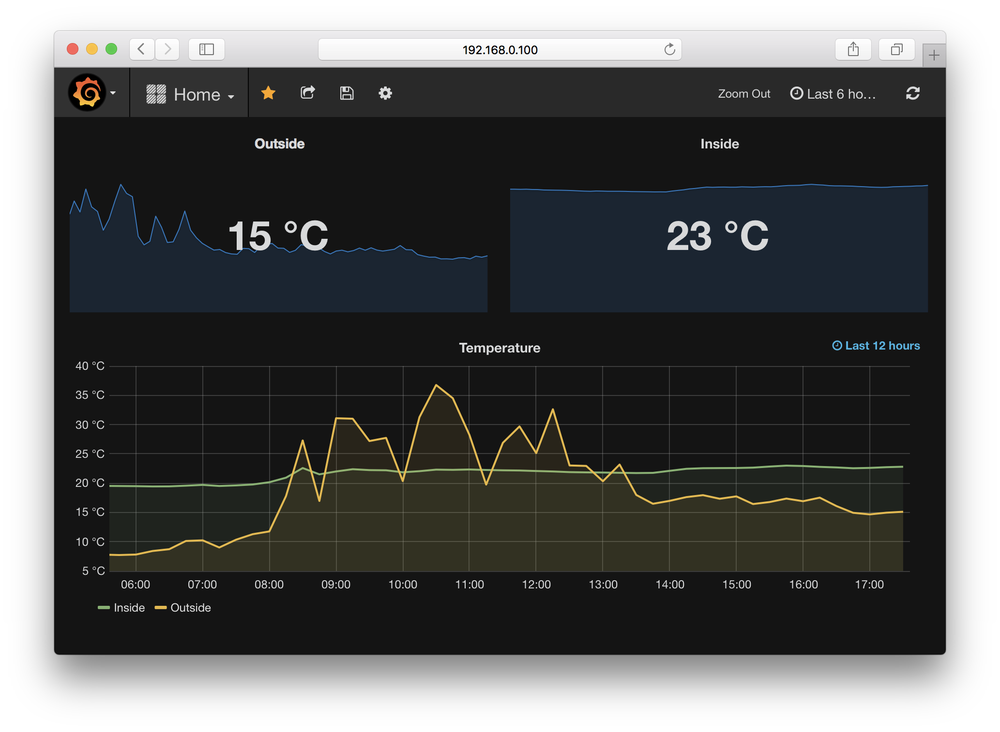

# Wire.js

Tiny service for Raspberry Pi, that monitors connected to the board 1-Wire devices and writes its data to Graphite.



Tested on the original Raspberry Pi B board (running Debian 8.0) with DS18B20 temperature sensors.

## Installation

Wire.js runs on Node.js 6+.

### Using a pre-build package

```
$ wget https://github.com/eprev/wirejs/releases/download/v1.0.0/wirejs_1.0.0_armhf.deb
$ sudo dpkg --install wirejs_1.0.0_armhf.deb
```

This  will install Wire.js to `/opt/wirejs`.

### Bulding from the sources

```
$ git clone git@github.com:eprev/wirejs.git
$ cd wirejs
$ make release
```

## Configutation

Copy `/opt/wirejs/etc/wire.sample.json` to `/opt/wirejs/etc/wire.json`.

Edit `/opt/wirejs/etc/wire.json`:

```js
{
    "carbon": {
        "host": "localhost",
        "port": "2003"
    },
    "path": "/sys/bus/w1/devices", /* This is default path to 1-Wire devices */
    "devices": [{
        "id": "28-0000049a0f4a",    /* Device ID */
        "type": "temperature",      /* Device Type (only `temperature` is supported for the time being) */
        "name": "home.temp.inside", /* Graphite metric's name */
        "interval": "60"            /* How often read from the device (in seconds) */
    }/*, ...*/]
}
```

## Running the service

```
# systemctl enable wirejs
# systemctl start wirejs
```

To see the log:

```
# journalctl -f -u wirejs
```
